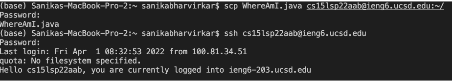

# Lab Report 1 Week 2

- I already had VSCode downloaded, but I ran into some difficulty finding the terminal 

- The command "ssh" lets you access the ieng6 server remotely. You log in through your given email/username and password. My personal command ssh cs15lsp22aab@ieng6.ucsd.edu

- You can use the command "cd" to change directory from the current one your working on

- The command scp WhereAmI.java cs15lsp22aab@ieng6.ucsd.edu:~ is an example of how you can copy a local file to the server home directory 

- Setting a ssh key lets you login to the ieng6 server without having to type your password or username. This shortens the commands/time needed signifigantly 

- You can use a semi colon to run multiple commands in the same line, allowing you to optimize remote running
