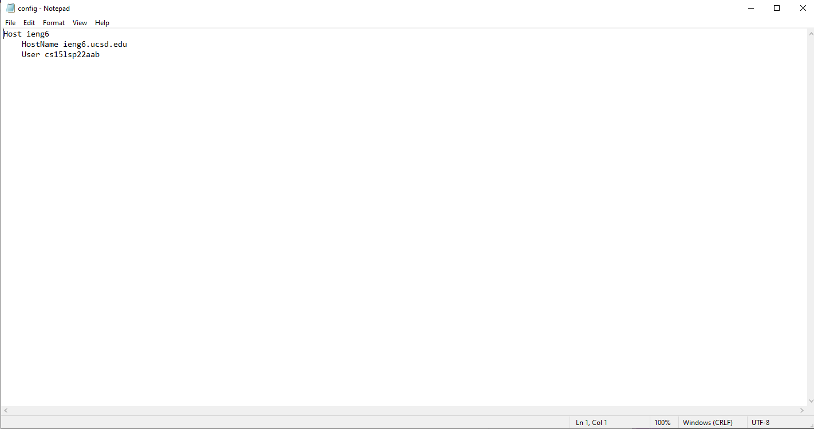
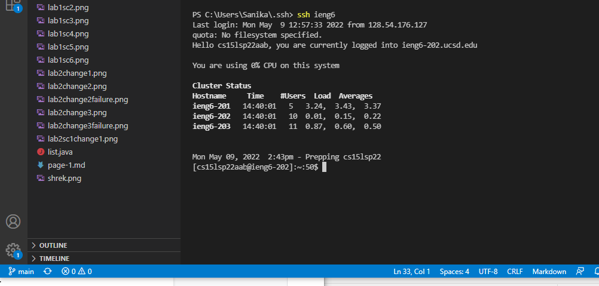
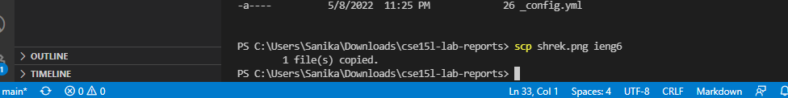
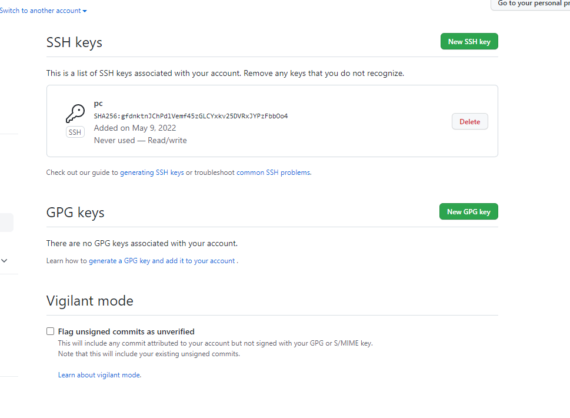
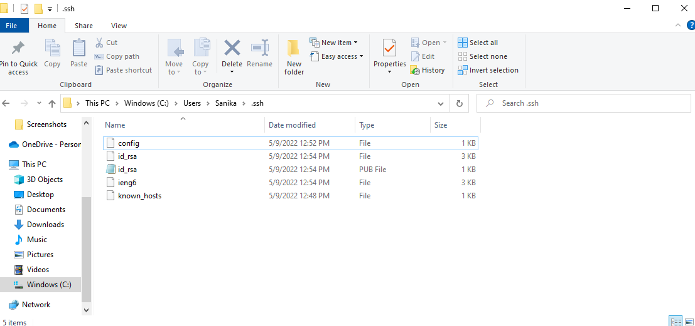
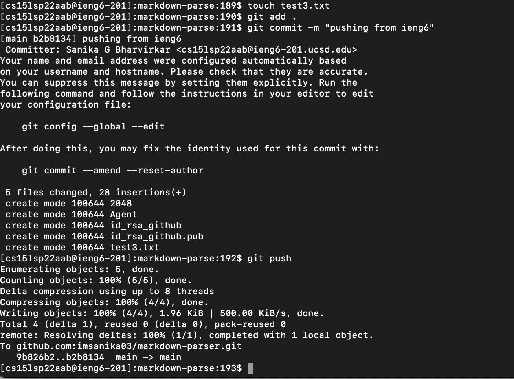
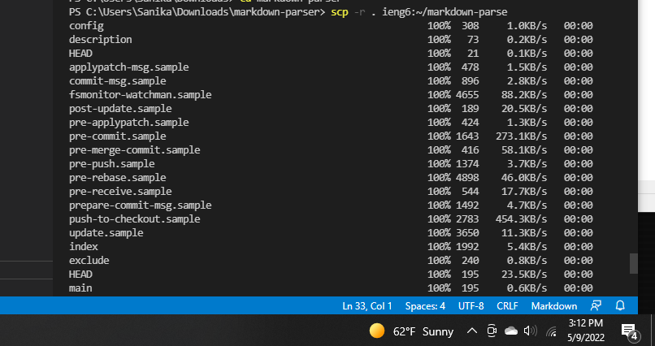
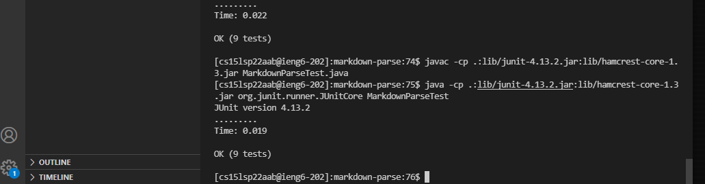
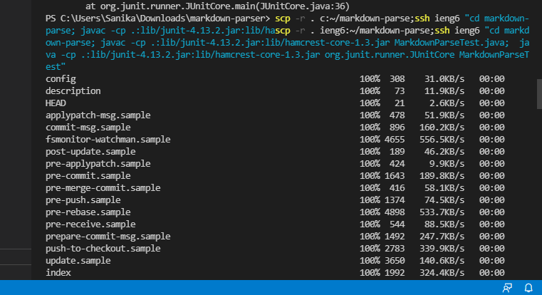

# Lab Report 3 Week 6

Streamlining ssh Configuration

- I edited it with Notepad on windows

- ssh with just ieng6 

- I copied an image of shrek to the ieng6 server using the new ssh configuration 

Setup Github Access from ieng6

- I added a new public key to my github settings

- Location of keys on my user   

- creating a file on ieng6 and committing/pushing the change with ssh key authorization 

[commit "pushing from ieng6"](https://github.com/imsanika03/markdown-parser/commit/b2b81341d4deda9bb075fef18fe15cbc097206c7)

Copy whole directories with scp -r

- I copied the markdown-parser directory using the scp -r command and the ieng6 alias from the choice 1 activity

- I ran the commands to execute MarkdownParserTest.java after copying the directory 

- I was able to condense all the commands into one line using semicolons and quotation marks 
