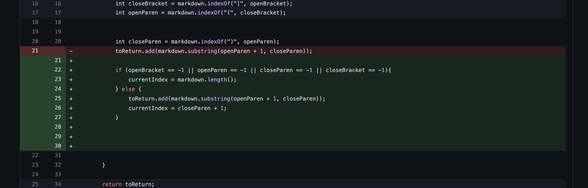
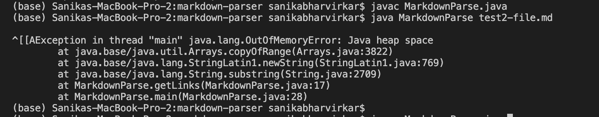
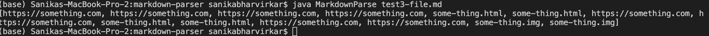
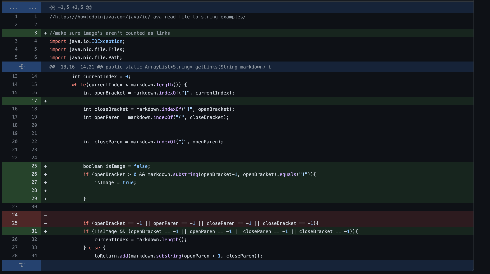
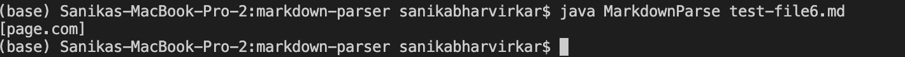

# Lab Report 2 Week 4

[File 1: Test file 2](https://github.com/imsanika03/markdown-parser/blob/main/test2-file.md)

-  The symptom of the bug was an infinite loop when processing test file 2. The bug was found to be that whenever the file was not ended on a link, the index of the next bracket would update to -1, and thus the program would parse from the beginning again. This was then fixed by checking for no other links were found towards the end of the file, and updating the working index (currentIndex) appropriately. 

[File 3: Test file 3](https://github.com/imsanika03/markdown-parser/blob/main/test3-file.md)

-  The symptom of the bug was more links being reported then were present in test file 3. The bug was that the add command wasn't inside the if-else loop, and thus the links would be added before the program checked if the current parsing index was back at the beginning of the file. 

[File 3: Test file 6](https://github.com/imsanika03/markdown-parser/blob/main/test-file6.md)

- The symptom of the bug was the program return text that was supposed to be images instead of links. The bug was that the code only checked for brackets, and not whether there was an exclamation mark in front of them to designate the text as an image. 
