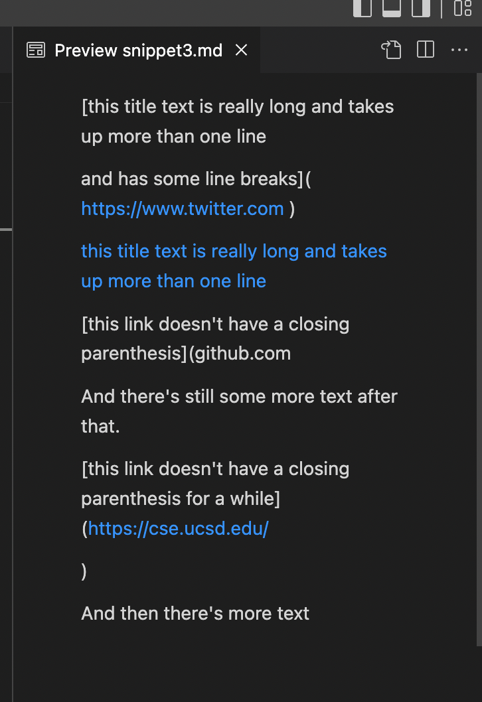

# Lab Report 4 Week 8 

- Link to my markdown parser repo: 
[Repo](https://github.com/imsanika03/markdown-parser)

- Link to Week 7 Markdown Parser repo: 
[Repo](https://github.com/nidhidhamnani/markdown-parser)

# Expected Snippet Output

- Snippet 1 

- Snippet 2

- Snippet 3

- Tests ran on my implementation: 

- Tests ran on the week 7 implementation: 

# Questions 

- Yes, there is a small snippet of code that could be added to check for  a ` before a bracket, preventing the rest of the text from being considered as a link 

- No, for Snippet 2 I think there needs to be a more invovled change. Because the program relies on finding the indicies of the paranthesis, there would need to be another way of distinguishing the end of a link. 

- Yes, a small change to the code making sure the link doesnt span more than a couple lines without break would result in a passing test. 