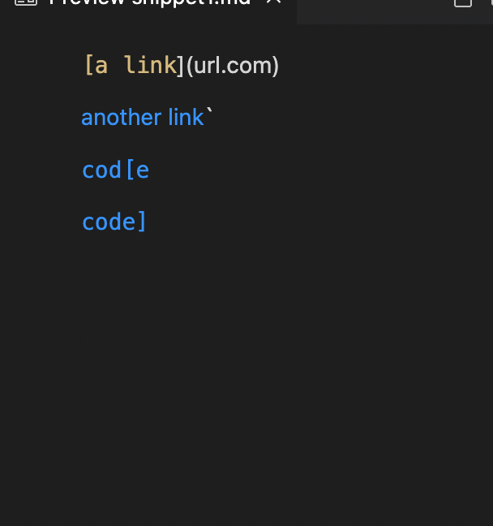

# Lab Report 4 Week 8 

- Link to my markdown parser repo: 
[Repo](https://github.com/imsanika03/markdown-parser)

- Link to Week 7 Markdown Parser repo: 
[Repo](https://github.com/nidhidhamnani/markdown-parser)

# Expected Snippet Output

- Snippet 1 

- Snippet 2

- Snippet 3

- Tests ran on my implementation: 

- Tests ran on the week 7 implementation: 

