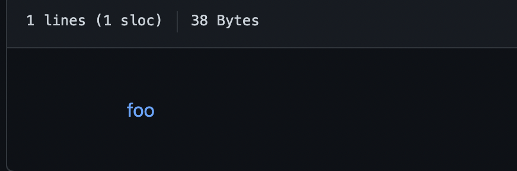
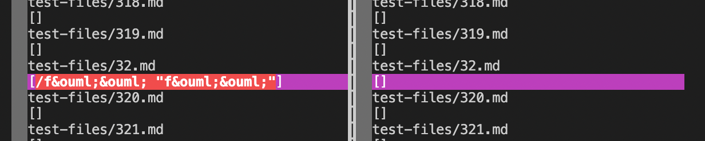
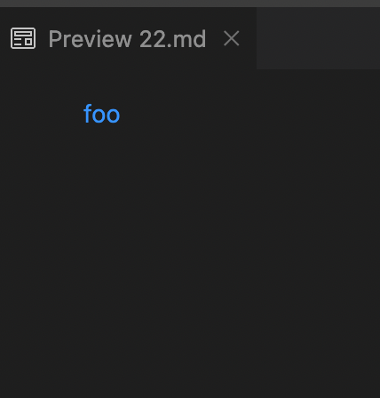
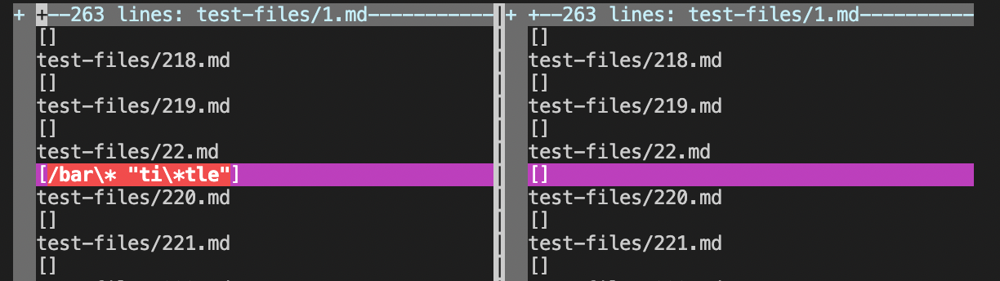

# Lab Report 5 Week 10

# 1 
I search using vimdiff. I redirected output from the bash script into two different results files and used vimdiff to find differing outputs. 

[Repo Link to First Test File](https://github.com/nidhidhamnani/markdown-parser/blob/main/test-files/32.md)

My implementation while the week 9 implementation is incorrect. For test file 32, this is the expected output: 

This is the actual output: 

The bug seems to be that when there is a space, the text isn't recognized as a link. 

[Repo Link to Second Test](https://github.com/nidhidhamnani/markdown-parser/blob/main/test-files/22.md)

My implementation seems to be correct while the week 9 implementation is wrong for test file 22. 

This is the expected outcome: 

This is the actual outcome: 

The bug again seems to be that whenever there is a space in the link, the week 9 implementation fails. 

